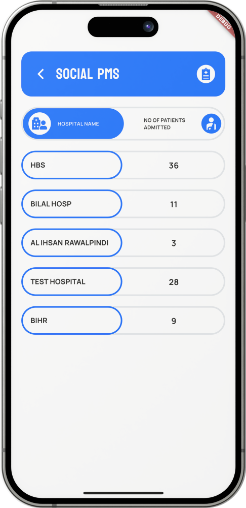

:pakistan: :pakistan: :pakistan:

<!-- 
-->
### Hi there 👋

<!-- Below are Apps that I have worked on and are live.
<a href="https://linkmix.co/19629911" target="_blank">PlayStore Apps</a> -->
<!--
**SaadTanveer14/SaadTanveer14** is a ✨ _special_ ✨ repository because its `README.md` (this file) appears on your GitHub profile.

Here are some ideas to get you started:

- 🔭 I’m currently working on ...
- 🌱 I’m currently learning ...
- 👯 I’m looking to collaborate on ...
- 🤔 I’m looking for help with ...
- 💬 Ask me about ...
- 📫 How to reach me: ...
- 😄 Pronouns: ...
###⚡ Fun fact: ...
-->

###
<!-- 

This is large text

This is medium text

This is small text

This is large bold text

This is medium bold text

This is small bold text
 -->

About Me

I am a Full Stack Mobile Application Developer specializing in Flutter, with extensive experience in building dynamic and feature-rich mobile apps for both iOS and Android. My expertise spans platform-specific functionalities, ensuring seamless performance on each device. Alongside development, I also bring creativity into my projects through design, delivering visually appealing and user-friendly apps.

Projects

Patient Management System (PMS)

The Patient Management System (PMS) is designed to ensure treatment transparency and track doctors' visits and attendance in multiple hospitals. The system allows doctors to mark their attendance within a defined radius, ensuring they are physically present at the hospital. It also facilitates doctors in providing patient feedback, capturing photos, recording audio from patients, and submitting their own feedback about the treatment. PMS operates both online and offline, enabling doctors to work in areas with limited internet connectivity, syncing data once the connection is restored. The app also offers reporting tools to track doctor performance, attendance, and leave management.

  
  |---------------------------------------------------------|
  
  |---------------------------------------------------------|
  

  
  
  

MOC (File Management App)

MOC is a file management app designed to simplify the process of managing and reviewing files digitally, mimicking the manual process of file handling. It allows users to replicate physical file actions such as adding remarks, rejecting files, and writing notes using a stylus on devices like the iPad. The app’s core feature is a custom canvas that enables users to write directly on files as if working with physical documents, making it ideal for pen-enabled devices. Users can also add additional remarks, upload attachments, and write on them, providing a comprehensive solution for file management.

  
  
  

  
  
  

Smart Clock

The app allows users to select their favorite teams and players, delivering tailored match schedules, news, and updates about those teams and players. This adds a layer of customization that makes the app a more immersive experience for football fans. In addition to personalized sports news, the app functions as a clock or timekeeping tool, possibly displaying real-time match start times or countdowns, and it can stay active as an always-on display (likely with low-power features like dark mode or ambient mode)

  
  
  

  

Balochistan Health Card Program App(BHCP)

The Balochistan Health Card Program (BHCP) is designed to assist registered users in finding nearby healthcare centers within the province. Using Google Maps integration, users can locate and navigate to healthcare centers with a simple tap, and view a list of treatments offered at each facility. The app also displays the user's remaining balance for treatments covered under the program and provides updates about the health card initiative. Additionally, users can access contact information and file complaints regarding any issues they face while availing services.

  
  
  

  
  
  

  
<!--  -->

<h2 align="center" style="font">languages and tools</h2>

<!-- $$"This is some centered text"$$ -->

<code></code>
<code></code>
<code></code>  

<code></code>
<code></code>  

<code></code>
<code></code>
<code></code>
<code></code>
<code></code>  

<code></code>
<code></code>
  

<!-- <code></code>
<code></code>

<code></code>

<code></code>
<code></code> -->

